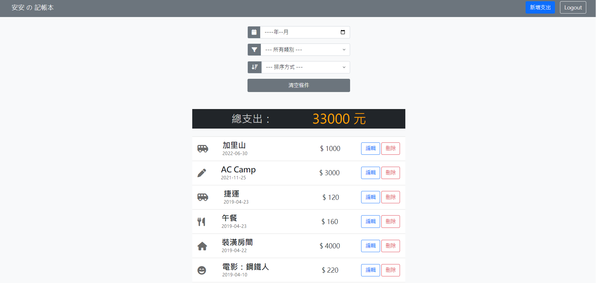
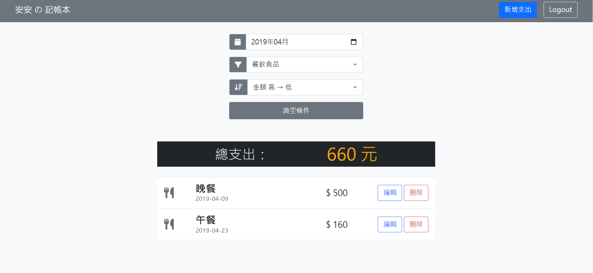

# 老爸的私房錢 Expense Tracker

:star: **Expense Tracker** is a website built with Node.js, Express and MongoDB. Users can `check`, `create`, `edit`and `delete` their expenses. Also you can find particular expenses by filter. 
<br>





## Features
- User can register and login as a user through email.
- User can check, create, edit, delete expenses.
- User can find particular expenses by date or category.
- User can sort expenses by price or date.

## Getting Start

### Environment Setup
- Node.js@14.16.0 
- express@4.17.3
- mongoose": "^6.1.6"
- express-session@1.17.1
- passport@0.4.1
- dotenv@8.2.0

### Installing
:white_check_mark: Clone or download the project to your folder

```bash
git clone https://github.com/bft7658/expense-tracker.git
```

:white_check_mark: Open `Terminal` to install the required packages  

```bash
npm install
```

:white_check_mark: Set environment variable 

```bash
1. Please change the filename ".env.example" to ".env"
2. Replace the MONGODB_URI with your URI in the ".env" file
```

:white_check_mark: Load the initial data

```bash
npm run seed
```

:white_check_mark: Start the server after install finished

```bash
npm run dev
```

:white_check_mark: Run the browser when your `Terminal` shows the link 

```bash
This website is running on http://localhost:3000
```

:white_check_mark: Create a new account or use seed account below to test any function

```bash
email: root@example.com
password: 12345678
```

:white_check_mark: Stop using browser by

```bash
Ctrl + c
```